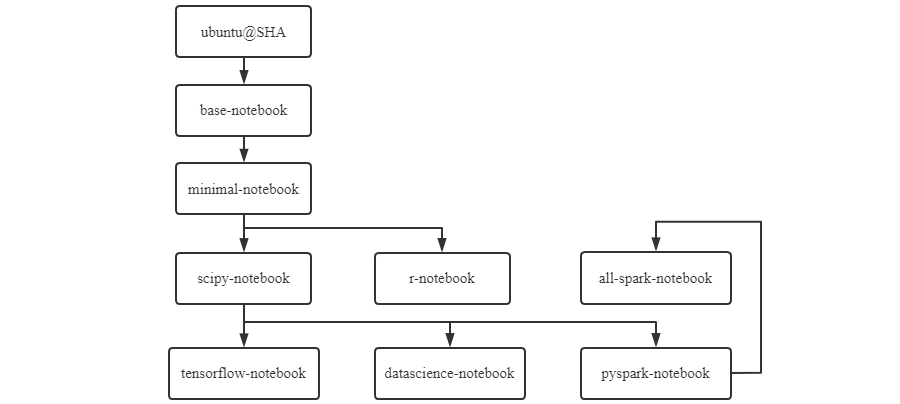

## Docker部署jupyter环境

### 官方镜像
+ jupyter/base-notebook
+ jupyter/minimal-notebook
+ jupyter/r-notebook
+ jupyter/scipy-notebook
+ jupyter/tensorflow-notebook
+ jupyter/datascience-notebook
+ jupyter/pyspark-notebook
+ jupyter/all-spark-notebook



#### 获取镜像
```shell
docker pull jupyter/minimal-notebook:python-3.10
docker run -itd -p 18888:8888 --name minimal-notebook -v ~/volumues/minimal-notebook:/home/jovyan/work jupyter/minimal-notebook:python-3.10


docker exec -it minimal-notebook bash
# 修改密码
jupyter notebook password

或者
 jupyter server list

#(base) jovyan@72b6c5d19fa6:~$ jupyter server list
#Currently running servers:
#http://72b6c5d19fa6:8888/?token=c7b0fee8e6af00c04525a295bab0f9ffb0d4e6d072f54aca :: /home/jovyan

访问http://localhost:18888/login?next=%2Flab%3F, 使用上面的token
```


### 参考资料
+ [《Jupyter Notebook工具介绍》](https://starcto.com/open-sourcing/213.html)